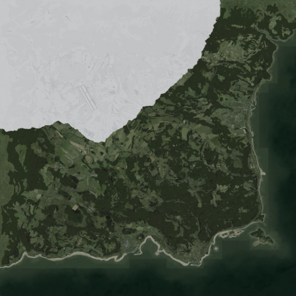

---
hide:
  - navigation
  - toc
---

# Welcome to MkDocs of A3S-Wiki

[:fontawesome-brands-discord: Discord](https://discord.gg/hvk9D6xyBJ){ .md-button }
[:material-home: Homepage](https://arma3survival.com/){ .md-button }
[:material-steam: Steam](https://steamcommunity.com/sharedfiles/filedetails/?id=1278609853){ .md-button }

What is the vision for the mod?
Arma 3 Survival strives to bring the nostalgia of Dayz mod to Arma 3. Additionally, we are adding new features and updates to enhance the experience and make a truly immersive survival mod. The vision of the mod is to create a harder survival experience than what you may find in most Dayz servers while having more content that assists in the immersion of the players.

<figure markdown>
  { width="300",loading=lazy }
  <figcaption>Chernarus</figcaption>
</figure>
